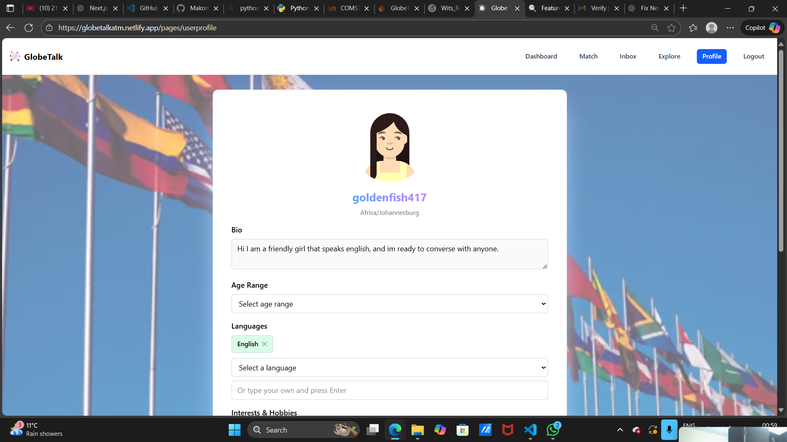
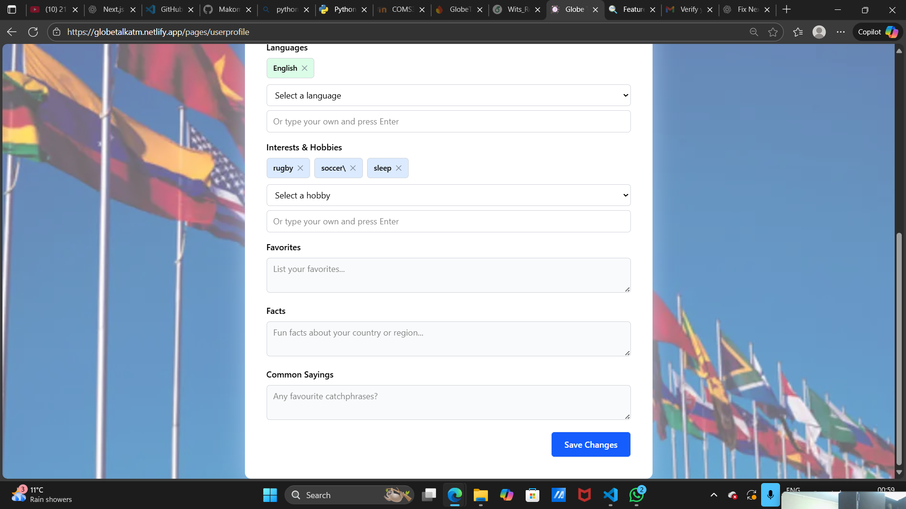
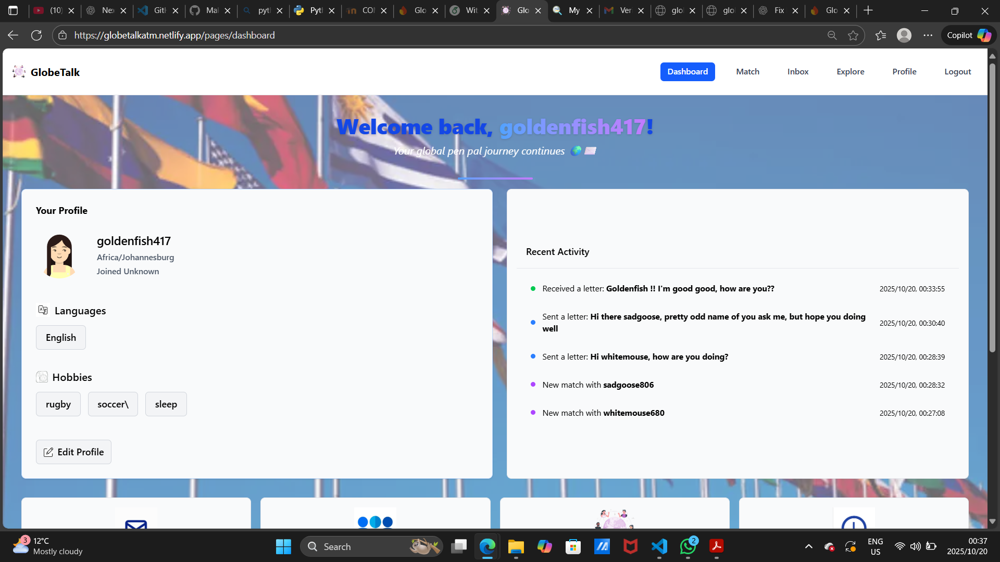
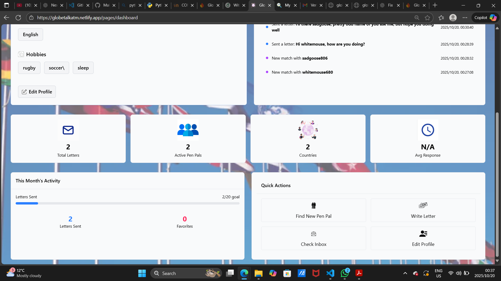
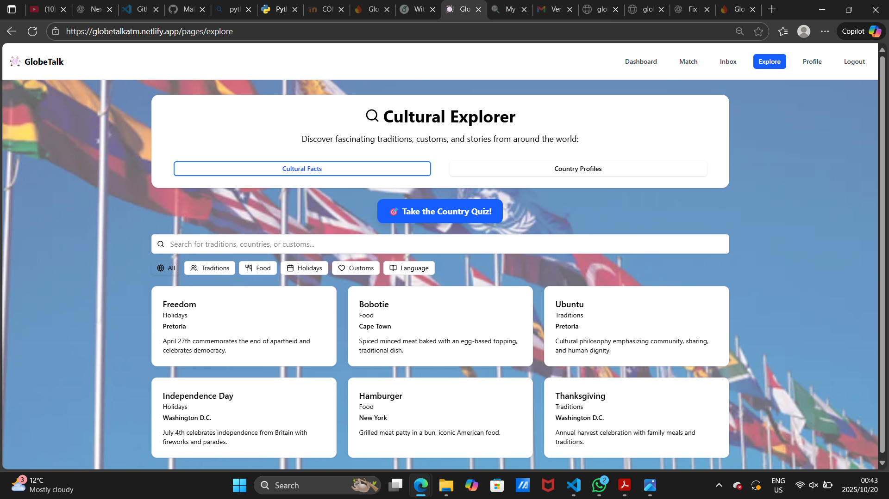
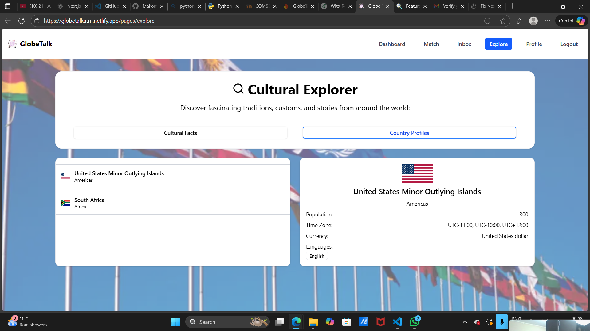

## Profile
{ width=900 height=600 align=center }
  
{ width=900 height=600 align=center}
  
The User Profile page allows users to create, customize, and update their personal information in an intuitive interface. After authentication, the system retrieves the user’s stored data from Firebase and the backend API, including their username, avatar, bio, hobbies, languages, timezone, and favorite activities. Users can edit or add details such as their introduction, age range, country, and common sayings to express their personality and culture. Dynamic dropdowns and custom input fields make it easy to add new hobbies or languages, while a live preview displays all updates instantly. Once saved, the profile data is securely stored through the API. This feature helps personalize the platform experience and enhances global connections by allowing users to showcase their interests, background, and individuality.

## Dashboard
{ width=900 height=600 align=center}
  
{ width=900 height=600 align=center}
  
The Dashboard serves as the user’s central hub, giving an overview of their global pen pal activity and personal progress on the platform. Once authenticated, users are greeted by name and can view their profile information, including avatar, username, timezone, and join date. The page dynamically loads data from Firebase and the backend API, displaying real-time statistics such as total letters sent, active pen pals, countries connected, and average response time.
Users can also view their selected languages and hobbies, each represented as interactive tags. The dashboard includes a visual monthly activity tracker, showing progress toward a 20-letter goal, along with a count of favorite letters. The Recent Activity section lists the user’s latest interactions — such as letters sent, received, or new matches — with timestamps and color-coded markers for clarity.
At the bottom, Quick Action cards allow users to instantly navigate to key areas: finding a new pen pal, writing or checking letters, and editing their profile. Overall, the dashboard provides a clean, data-driven overview of engagement, progress, and communication activity, ensuring users stay connected and informed throughout their global correspondence journey.

## Explorer Page
{ width=900 height=600 align=center}
  
The Cultural Facts section allows users to explore traditions, customs, holidays, and local practices associated with different countries. Using a CSV dataset filtered according to matched users’ countries, the app dynamically displays unique cultural facts drawn from multiple categories, such as food, holidays, and language. Users can refine their search by typing keywords or selecting from specific categories for more focused exploration. To make the experience engaging, the section also includes a Country Quiz that tests users’ knowledge of world cultures with randomized questions. Together, these features transform learning about global diversity into an interactive experience, helping users build cultural awareness and appreciation through discovery and fun participation.

  

{ width=900 height=600 align=center}
  
The Country Profiles feature gives users an interactive way to explore detailed information about different countries they’ve matched with on the platform. When a user connects with people from other regions, the system automatically detects the time zones associated with those users and maps them to their respective countries. Each profile presents verified data fetched from the REST Countries API, including the national flag, coat of arms, region, population size, local time zone, currency, and primary languages spoken. The list of countries appears on the left panel, and clicking on any of them instantly loads its profile card on the right. This feature provides users with quick cultural and geographical insights about their matches, helping them understand more about the global community they are engaging with.

