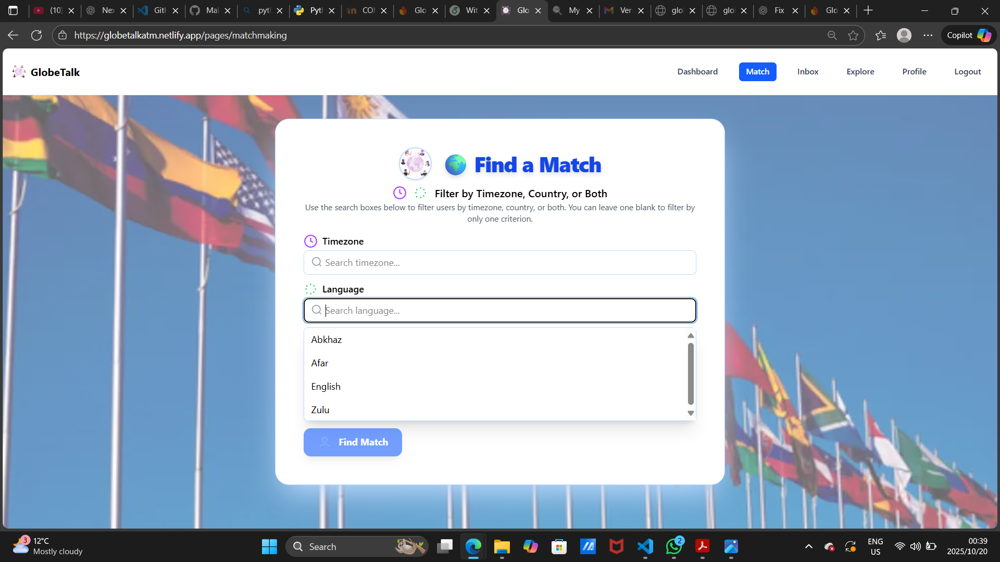

## Random Matchmaking
{ width=900 height=600 align=center}
  
{ width=900 height=600 align=center}
  
### User Experience and Interface
The random matchmaking feature allows users to discover new connections based on their preferences for timezone and language. When you visit the matchmaking page, you'll see a clean interface with search boxes for filtering by timezone and language. You can choose to filter by just timezone, just language, or both criteria to find your ideal match. The system requires at least one filter to be selected before you can search. Once you click "Find Match," the system searches through all available users who meet your criteria and randomly selects one compatible person for you to connect with. The matched user's profile displays their avatar, username, name, language, timezone, age range, hobbies, and other details to help you decide if you'd like to start a conversation.
### Matching Algorithm and Process
The random matchmaking system works by first excluding users you've already matched with previously, ensuring you meet new people each time. The algorithm scans through all user profiles in the database and filters them based on your selected timezone and language preferences. If you specify a timezone, it only shows users from that exact timezone. For language filtering, it matches users who either speak that specific language as their primary language or have it listed among their known languages. Once all compatible users are identified, the system uses a random number generator to select one user from the filtered pool, ensuring each search gives you a different potential match. After viewing the match details, you can choose between a one-time chat or long-term chat option before proceeding to start your conversation in the inbox.