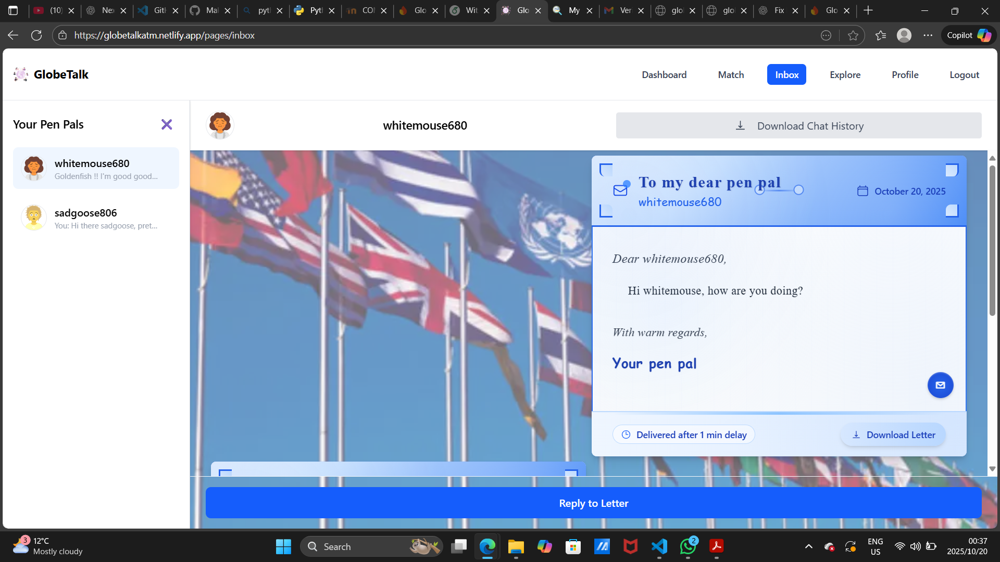
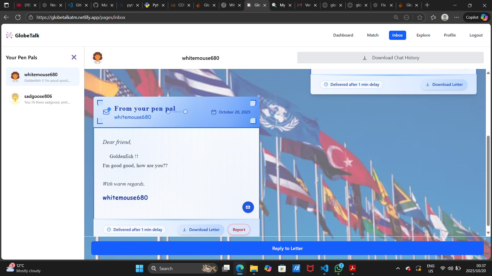
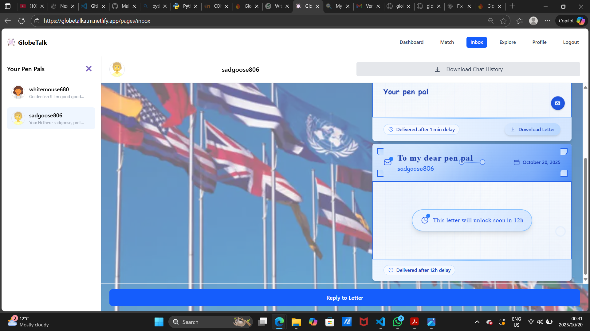

## Inbox Chatting System
{ width=900 height=600 align=center}
  
{ width=900 height=600 align=center}
  
{ width=900 height=600 align=center}
  
{ width=900 height=600 align=center}
  

### Interface and Navigation
The inbox serves as your central hub for all pen pal conversations, featuring a responsive design that adapts to both desktop and mobile devices. On desktop, you'll see a collapsible sidebar on the left showing all your active pen pal conversations, each displaying the friend's avatar, username, and a preview of the last message. The main chat area takes up the right side, where you can view and participate in conversations. On mobile, the interface switches between a list view of all your pen pals and the individual chat view. The sidebar can be toggled open or closed, and if you have no pen pals yet, you'll see an empty state with a button to find new matches through the matchmaking system.

### Letter-Based Messaging System
The inbox features a unique letter-based messaging system that simulates traditional pen pal correspondence. When you compose a message, you can set delivery delays ranging from 1 minute to 1 day, creating an authentic pen pal experience where letters don't arrive instantly. Messages are displayed as beautifully formatted letters with decorative borders, headers showing sender/recipient information, and delivery timestamps. Each letter shows a countdown timer until it unlocks, and once delivered, you can download individual letters or entire chat transcripts as PDFs. The system includes real-time polling to automatically fetch new messages every 3 seconds, ensuring you don't miss any correspondence. You can reply to letters through a modal composer that lets you set delivery delays and write up to 1000 characters per message, maintaining the thoughtful, deliberate nature of traditional pen pal communication.