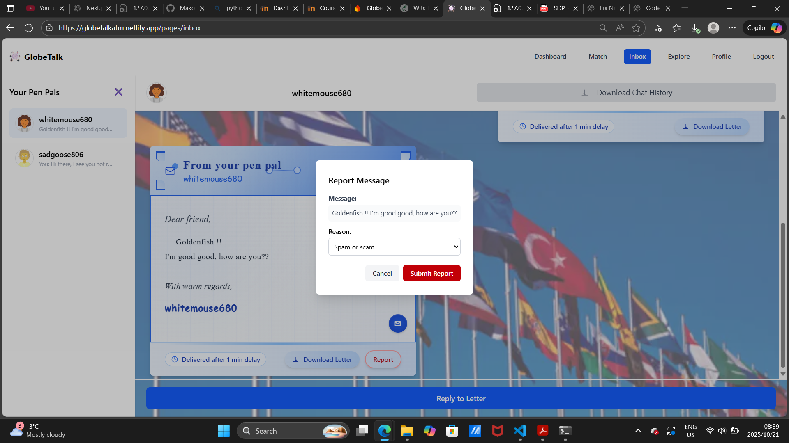
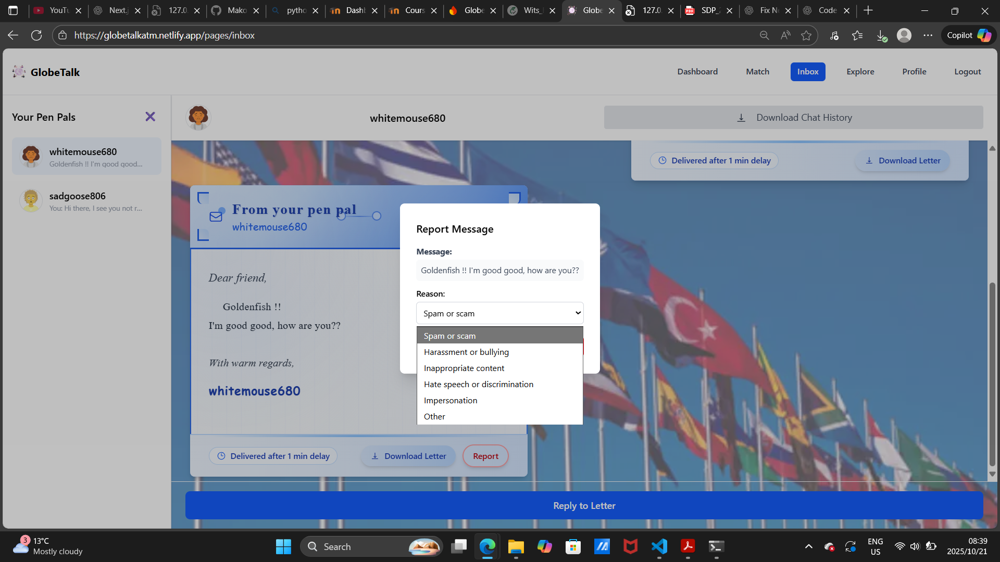
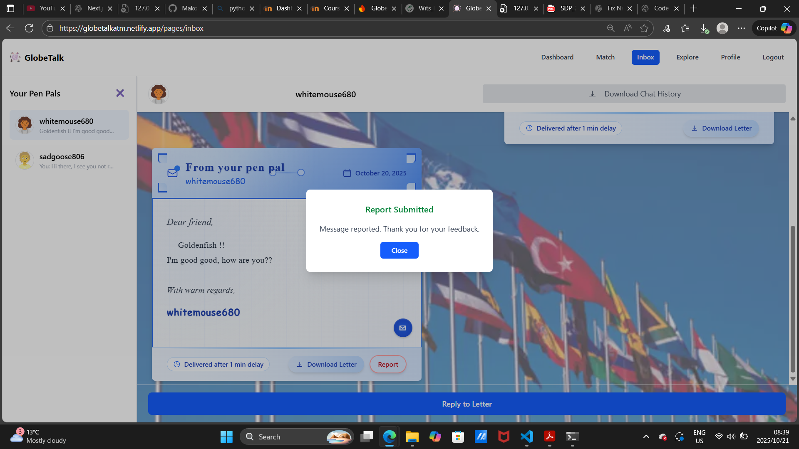
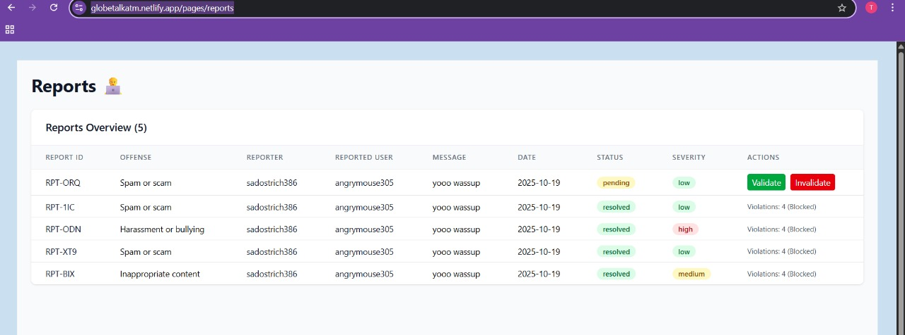

## Reporting a User
{ width=900 height=600 align=center}
  
{ width=900 height=600 align=center}
  
{ width=900 height=600 align=center}
  

The Report button appears on received, unlocked letters (never on your own messages). Tapping it opens a modal where you choose a reason—defaulting to “Spam or scam”—or select “Other” to provide custom details. The app automatically looks up both participants’ usernames and packages the report with the chat ID, the exact message content, reporter and reported user IDs/usernames, and your chosen reason. Submissions are validated to prevent empty reasons, then securely sent to the server for review without interrupting your conversation. On success, a confirmation popup briefly appears; on cancel, the modal simply closes. Reports are designed to be quick to file (one click from the letter footer), visible only when a message has actually been delivered, and unavailable for your own messages—helping keep the experience respectful while ensuring moderation has the context needed to act.
  

## Admin Page
{ width=900 height=600 align=center}
### How it works
The reports page is a restricted administrative dashboard accessible only to users with the specific email "gamersboysa@gmail.com". The system performs strict authentication checks, redirecting unauthorized users immediately. Once authorized, the page displays a comprehensive moderation interface showing all user-submitted reports in a detailed table format. The dashboard includes real-time polling every 5 seconds to automatically refresh data, with intelligent failure handling that pauses polling after 3 consecutive errors to prevent system overload.
### Report Management and Moderation Actions
Each report displays essential information including a unique report ID, offense type, reporter and reported usernames, the actual message content, submission date, current status, and automatically calculated severity levels (high for harassment/hate/threats, medium for inappropriate content, low for others). Moderators can validate reports (marking them as resolved and incrementing the reported user's violation count) or invalidate them (rejecting false reports). The system tracks violation counts per user and automatically suggests blocking users who accumulate 3+ violations. When validating reports, the system records detailed violation entries including report ID, reason, chat context, message content, reporter information, and timestamps. The interface prioritizes pending reports at the top, with resolved reports sorted below, and includes error handling for server connectivity issues with clear user feedback about backend availability.

