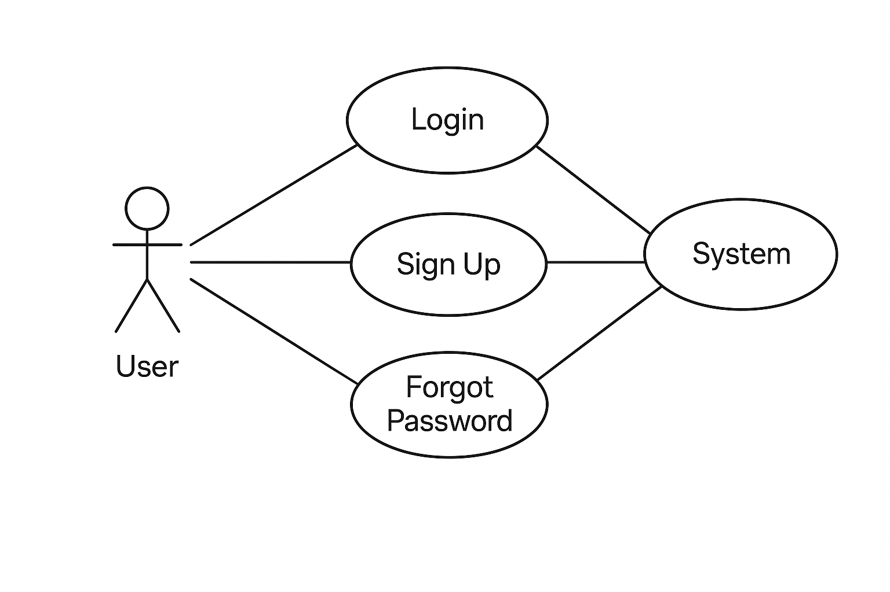
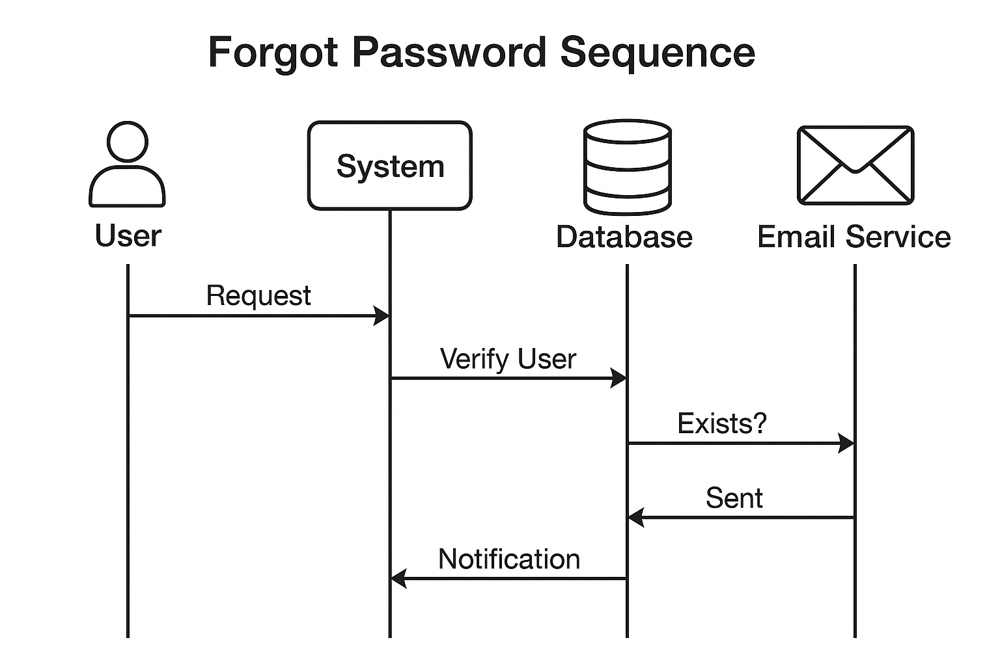
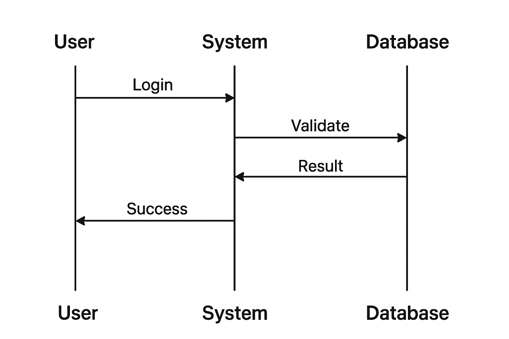
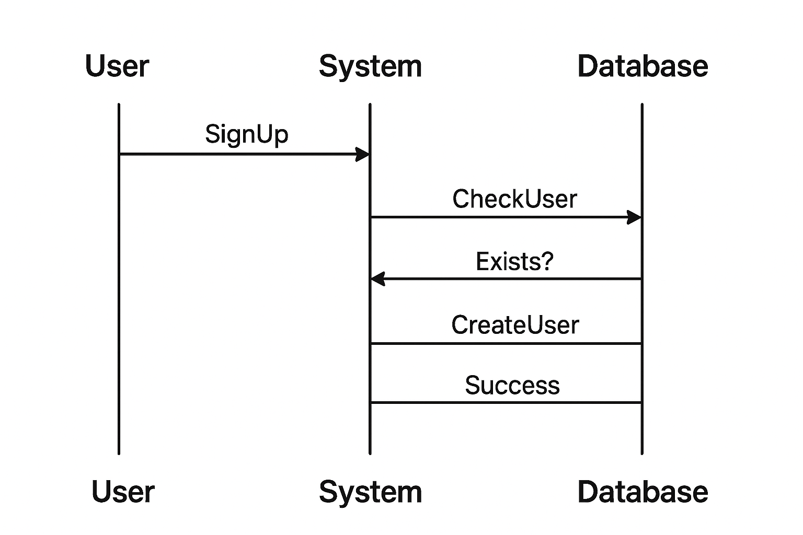
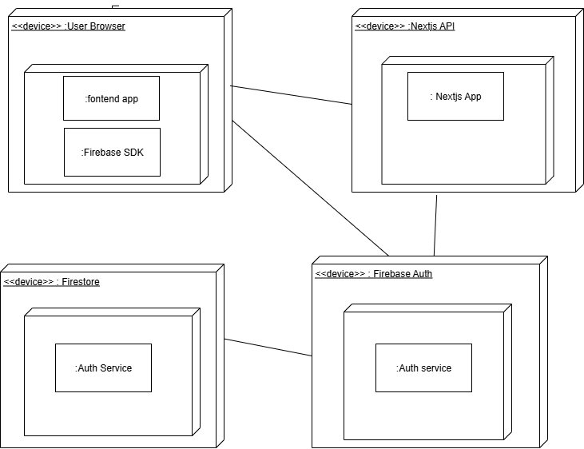

# Sprint 1

## Use case diagram
### Login

Note that the system in this case above for the use case diagram is the third party authenticator which is firebase.

## Sequence diagrams
### Forgetpassword

### Login

### SignUp

## Physical View (Deployment Diagram)

