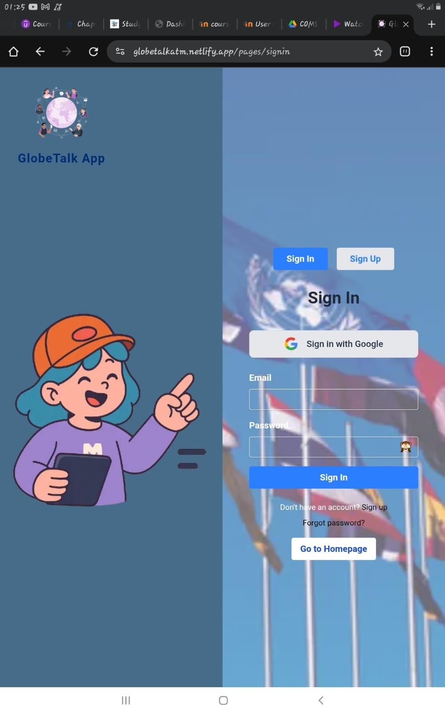
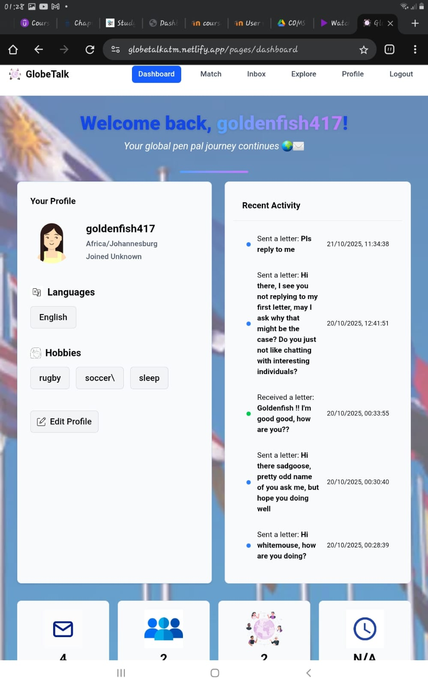
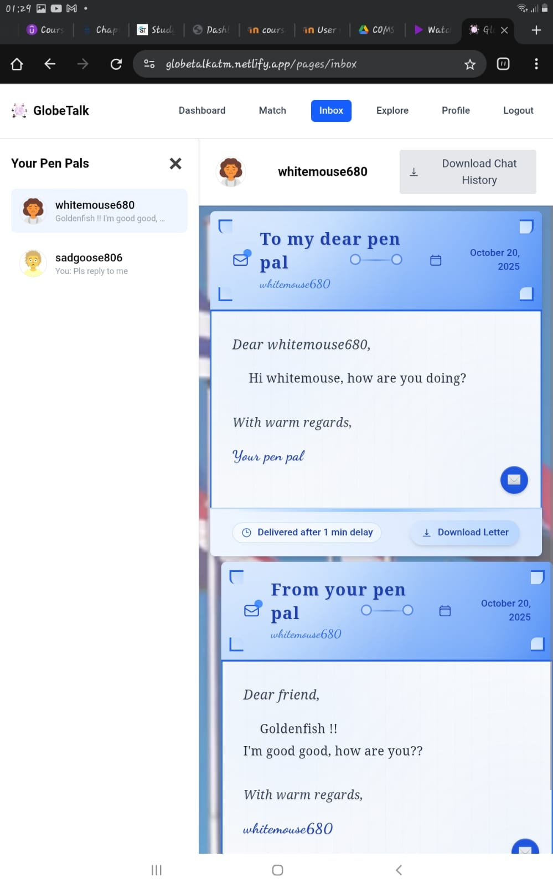
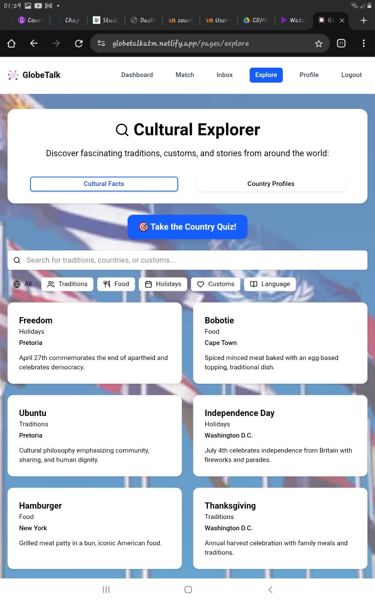
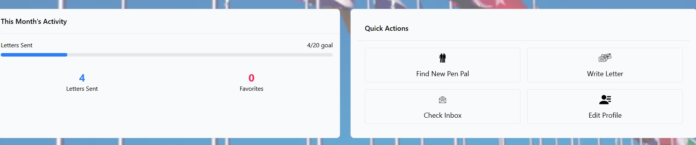

## Accessibility Analysis: GlobeTalk Application
### Current Accessibility Status
1. **Strengths**

    <!-- **Current Accessibility Issues:** -->

    - Responsive Design:  Application adapts well across different screen sizes and devices
    - Visual Hierarchy: Clear content organization with appropriate heading structure in most components
    - Interactive Elements: Functional buttons and form controls with hover states
    - Color Scheme: Generally good contrast ratios between text and background elements

      
2. **Possible User Experience Improvements**

    - Focus indicators could be enhanced for keyboard navigation visibility
    - Form validation feedback could be more prominent for user guidance
    - Modal dialogs could include better focus management for accessibility
      
    

### Compliance Assessment
The application demonstrates good foundational accessibility practices with room for targeted improvements. The responsive design and clear visual hierarchy provide a solid base for user experience. Focused enhancements in semantic markup and interactive element labeling would elevate the overall accessibility compliance.

## Aesthetics

GlobeTalk demonstrates a cohesive and visually appealing design system that creates an engaging user experience. The application employs a consistent color palette centered around blue tones (#476C8A primary, with complementary grays and accent colors) that reinforces the global communication theme. Typography follows a clear hierarchy using Inter and Fairplay Display fonts, while the interface maintains visual consistency through standardized spacing, rounded corners, and shadow effects. The design successfully balances modern aesthetics with functional clarity, featuring clean layouts, appropriate use of white space, and intuitive iconography. Visual elements like the globe imagery and pen pal illustrations effectively reinforce the application's core purpose while maintaining professional presentation across all pages.

## Deployment
GlobeTalk is successfully deployed as a modern web application with a robust frontend architecture built on Next.js and React. The application utilizes Netlify for hosting, providing reliable global content delivery and automatic deployments from the source repository. The frontend codebase in the src directory is well-structured with component-based architecture, featuring pages for authentication, dashboard, profile management, matchmaking, and messaging functionality. The deployment includes optimized static assets, responsive design implementation, and seamless integration with Firebase for authentication and backend services. The application demonstrates professional deployment practices with proper environment configuration and scalable hosting infrastructure.

## Performance
GlobeTalk demonstrates excellent performance characteristics with fast loading times and responsive user interactions. The application leverages Next.js optimization features including automatic code splitting, image optimization, and efficient rendering strategies that ensure quick page transitions and minimal loading delays. User input responsiveness is immediate across all interactive elements, from form submissions to real-time messaging features. The application's performance can be tested firsthand at our live deployment: https://globetalkatm.netlify.app/ where users can experience the smooth navigation, fast authentication flows, and responsive matchmaking system. The frontend architecture efficiently handles data fetching, state management, and user interactions without noticeable lag, providing a seamless pen pal communication experience.

## Features
GlobeTalk's features are fully implemented and work as intended, providing users with a complete pen pal communication platform. The application successfully delivers core functionality including user authentication, profile management, matchmaking system, real-time messaging, and cultural exploration features. All features demonstrate proper implementation with seamless user experience and reliable performance. For detailed information about GlobeTalk's comprehensive feature set, please visit: 
       https://makomanetau.github.io/my-docs/documentation/Features/feature1/
    ,   https://makomanetau.github.io/my-docs/documentation/Features/feature2/
    ,   https://makomanetau.github.io/my-docs/documentation/Features/feature3/
    ,   https://makomanetau.github.io/my-docs/documentation/Features/feature4/

## Responsiveness
GlobeTalk demonstrates excellent responsiveness across all device types and screen sizes. The application utilizes responsive design principles with mobile-first approach, featuring adaptive layouts, flexible grid systems, and touch-friendly interfaces. The codebase includes comprehensive media queries and responsive components that ensure optimal user experience on laptops, tablets, and mobile browsers. All interactive elements are appropriately sized for touch interaction while maintaining desktop functionality. Some demontrations on a laptop can be found clicking the links on Features above. Demonstartions of images on Mobile devices can be seen below:
  

**Login on Mobile**
{width=600 height=900 }
  
  

**Dashboard on Mobile**
{width=600 height=900 }
  
  

**Inbox chatting system on Mobile**
{width=600 height=900 }
  
  

**Explorer Page on Mobile**
{width=600 height=900 }

## Structure
GlobeTalk features an intuitive interface with clear navigation that makes core features easily accessible to first-time users. The top navigation bar provides straightforward access to Dashboard, Match, Inbox, Explore, and Profile sections. The dashboard's Quick Actions section prominently displays buttons for finding pen pals, writing letters, checking inbox, and editing profiles, ensuring new users can quickly discover and access all essential functionality without confusion.

**Quick Actions on Dashboard**

**Horizontal Navigation bar**

