## Sprint 1 meeting evidence

- **Product Backlog:** this is shown inside of Trello.

- **Sprint Planning Meeting (Meeting 1):** 
  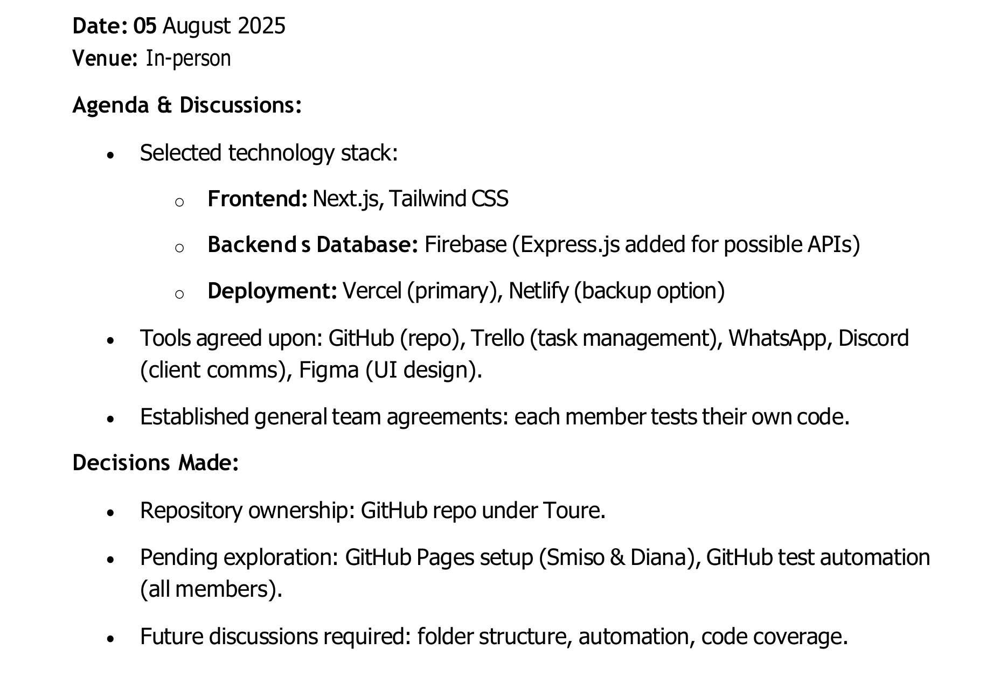

- **Task Allocation & Progress Review (Meeting 2):**
  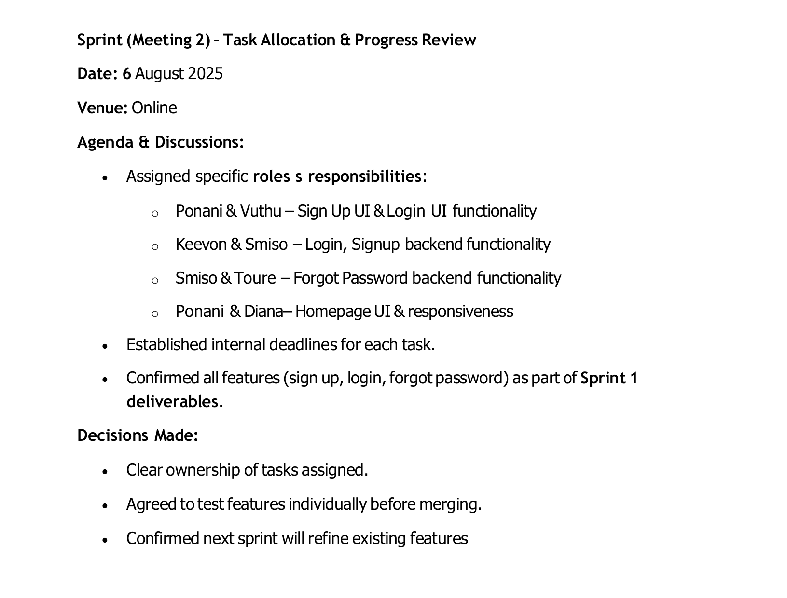
  
  
  
- **UI Design & Initial Development (Meeting 3):** 
  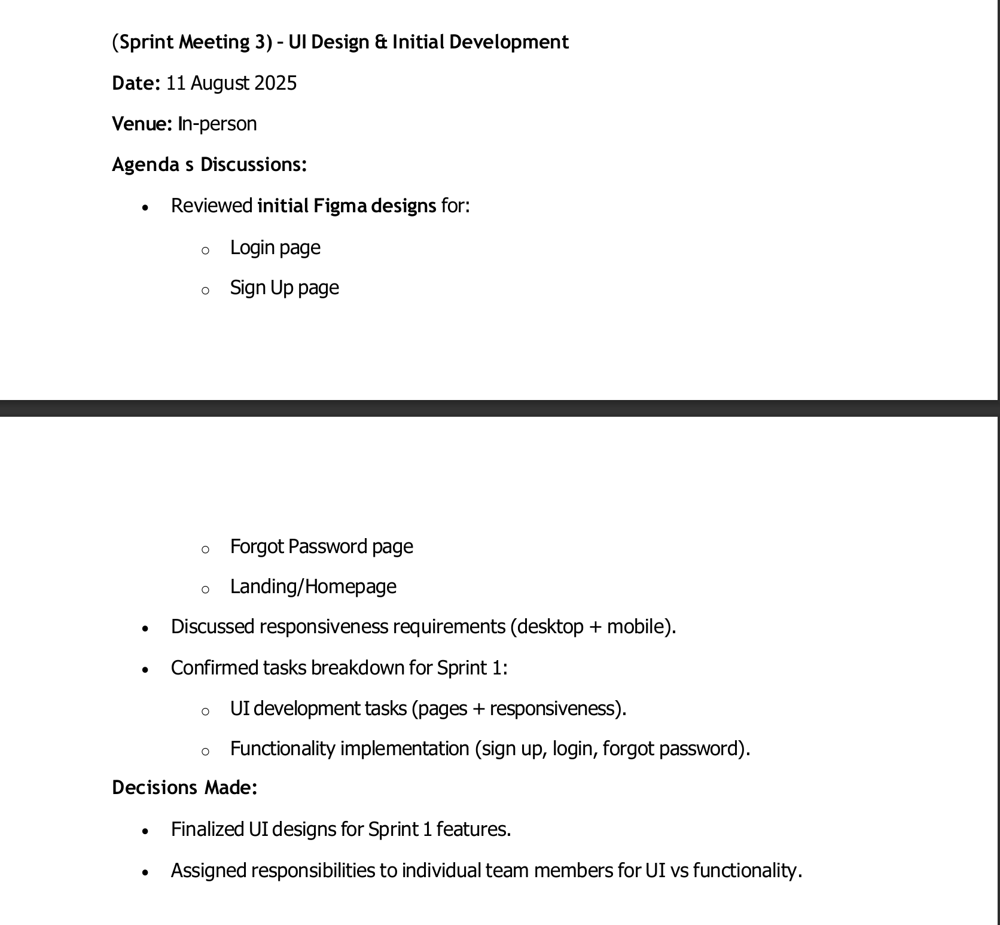
  

- **Repository & Collaboration Setup (Meeting 4):** 
  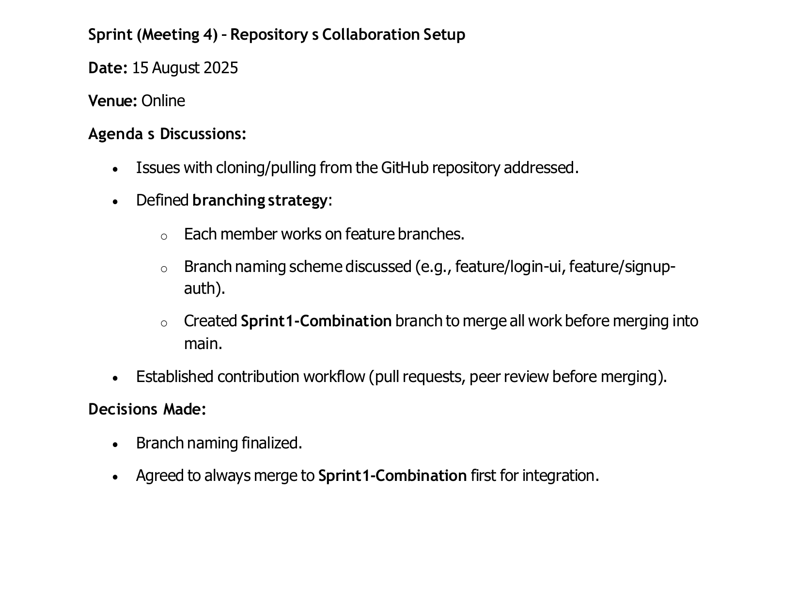
  

d
## Sprint 2 meeting evidence

- **Product Backlog:** this is shown inside of Trello.

- **Sprint Planning Meeting (Meeting 1):** 
  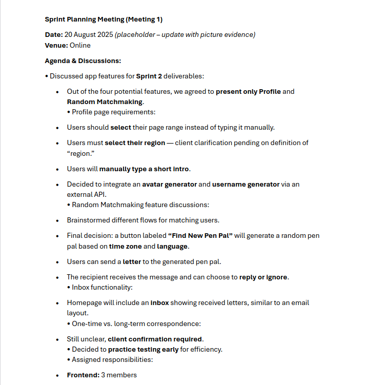
  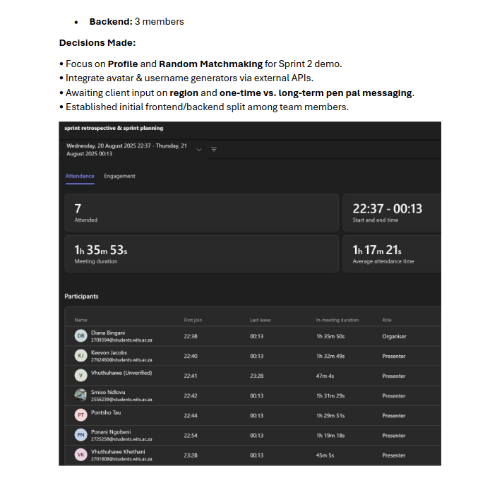

- **Design Implentation & Estimates (Meeting 2):**
  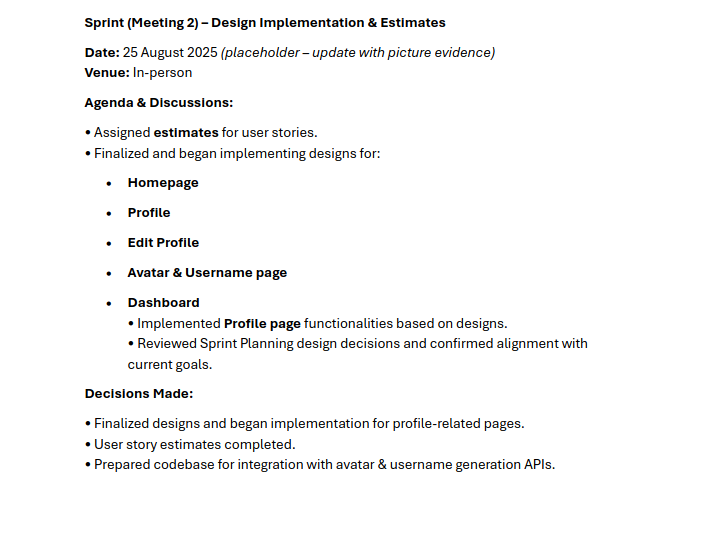

- **Random Matchmaking Developement & GitHub Merge (Meeting 3):** 
  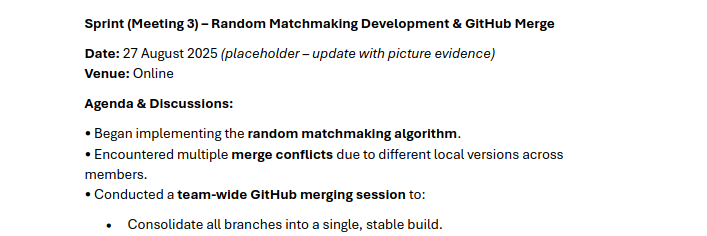
  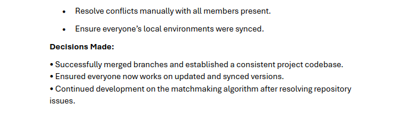

- **Testing Startegy & User Feedback (Meeting 4):** 
  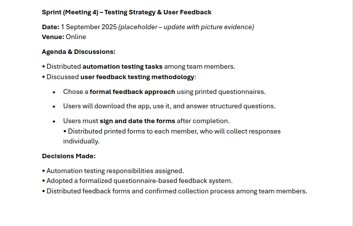

  
- **Stakeholder Review :** 

  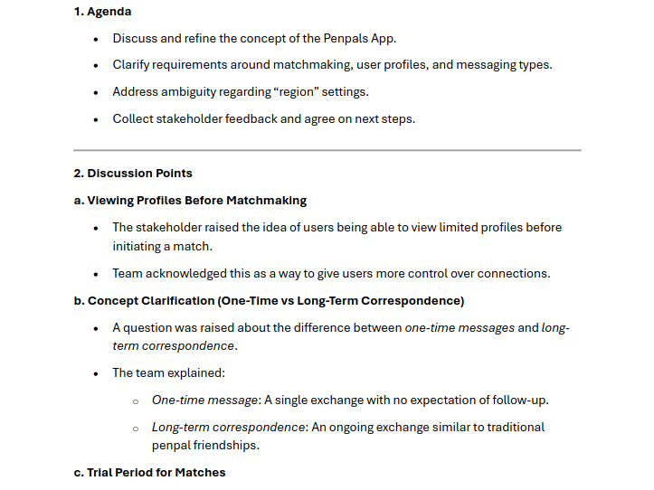
  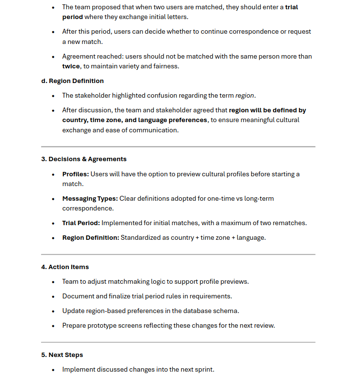
  

