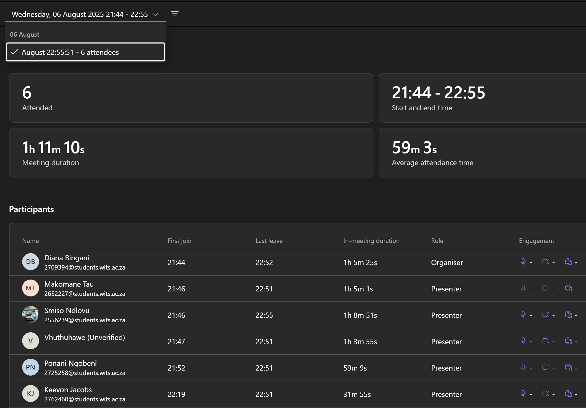
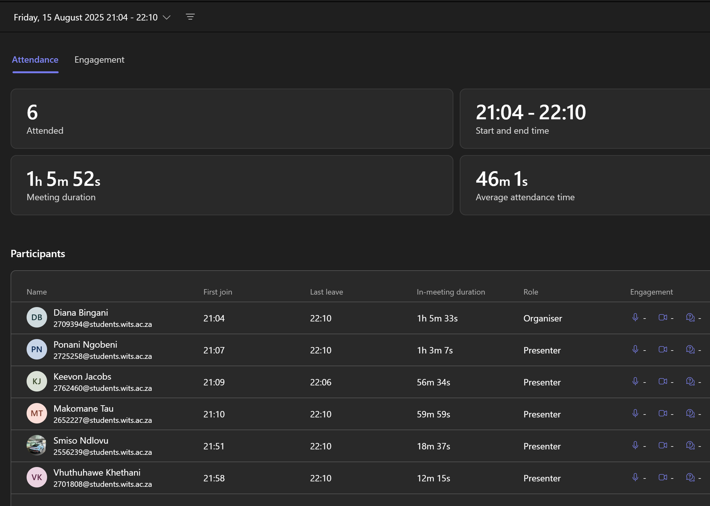

# Meetings

## Sprint 1 Meeting Evidence

- **Meeting 1: Technology Stack & Team Agreements**
  - **Date:** 05 August 2025  
  - **Venue:** In-person
  - **Agenda & Discussions:**
    - Selected technology stack: Next.js, Tailwind CSS (frontend); Firebase, Express.js (backend); Vercel/Netlify (deployment)
    - Tools: GitHub, Trello, WhatsApp, Discord, Figma
    - Team agreement: each member tests their own code
  - **Decisions Made:**
    - GitHub repo under Toure
    - Explore GitHub Pages (Smiso & Diana), test automation (all)
    - Future: folder structure, automation, code coverage

- **Meeting 2: Task Allocation & Progress Review**
  - **Date:** 6 August 2025  
  - **Venue:** Online
  - **Agenda & Discussions:**
    - Assigned roles:
      - Ponani & Vuthu: Sign Up UI & Login UI
      - Keevon & Smiso: Login, Signup backend
      - Smiso & Toure: Forgot Password backend
      - Ponani & Diana: Homepage UI & responsiveness
    - Set internal deadlines; confirmed all features for Sprint 1
  - **Decisions Made:**
    - Clear task ownership
    - Test features before merging
    - Next sprint: refine features
  - 

- **Meeting 3: UI Design & Initial Development**
  - **Date:** 11 August 2025  
  - **Venue:** In-person
  - **Agenda & Discussions:**
    - Reviewed Figma designs (Login, Sign Up, Forgot Password, Homepage)
    - Responsiveness requirements
    - Task breakdown: UI development, functionality implementation
  - **Decisions Made:**
    - Finalized UI designs for Sprint 1
    - Assigned UI vs functionality responsibilities

- **Meeting 4: Repository & Collaboration Setup**
  - **Date:** 15 August 2025  
  - **Venue:** Online
  - **Agenda & Discussions:**
    - Addressed repo cloning/pulling issues
    - Defined branching strategy (feature branches, naming scheme)
    - Created Sprint1-Combination branch for integration
    - Established PR/peer review workflow
  - **Decisions Made:**
    - Finalized branch naming
    - Always merge to Sprint1-Combination first
  - 

## Sprint 2 Meeting Evidence

- **Meeting 1: Sprint Planning**
  - **Date:** 20 August 2025  
  - **Venue:** Online
  - **Agenda & Discussions:**
    - Features for Sprint 2: Profile, Random Matchmaking
    - Profile page: select page range, region (pending client), intro, avatar/username generator
    - Random Matchmaking: button to find pen pal, send/receive letters, inbox, one-time vs long-term (pending client)
    - Early testing
    - Assigned frontend/backend split
  - **Decisions Made:**
    - Focus on Profile & Random Matchmaking for demo
    - Integrate avatar/username APIs
    - Await client input on region & pen pal messaging
    - Initial frontend/backend split
  - 

- **Meeting 2: Design Implementation & Estimates**
  - **Date:** 25 August 2025  
  - **Venue:** In-person
  - **Agenda & Discussions:**
    - Assigned user story estimates
    - Finalized/began implementing designs (Homepage, Profile, Edit Profile, Avatar & Username, Dashboard)
    - Implemented Profile page functionality
    - Reviewed design decisions
  - **Decisions Made:**
    - Finalized designs, began implementation
    - User story estimates completed
    - Prepared for avatar/username API integration

- **Meeting 3: Random Matchmaking Development & GitHub Merge**
  - **Date:** 27 August 2025  
  - **Venue:** Online
  - **Agenda & Discussions:**
    - Began matchmaking algorithm
    - Merge conflicts from local versions
    - Team-wide merging session: consolidate, resolve conflicts, sync environments
  - **Decisions Made:**
    - Merged branches, consistent codebase
    - Continued matchmaking development
  - 

- **Meeting 4: Testing Strategy & User Feedback**
  - **Date:** 1 September 2025  
  - **Venue:** Online
  - **Agenda & Discussions:**
    - Distributed automation testing tasks
    - User feedback: formal questionnaires, printed forms, collection process
  - **Decisions Made:**
    - Assigned automation testing
    - Adopted questionnaire feedback system
    - Distributed/collected forms

## Sprint 3 Meeting Evidence

- **Meeting 1: Sprint Planning**
  - **Date:** 4 September 2025  
  - **Venue:** Online
  - **Agenda & Discussions:**
    - Features: Improvements to Profile, Random Matchmaking, Chatting System, Cultural Explorer
    - Chatting System: data model, Firestore collections, REST endpoints, moderation, dashboard, real-time updates, security, extensibility
    - Cultural Explorer: country profiles (REST API), country facts (manual dataset)
  - **Decisions Made:**
    - Focus on Chatting System & Cultural Explorer for demo
    - Explorer: country profiles (API), facts (dataset)
    - Chat system: Firestore collections

- **Meeting 2: Designs for Implementation & Estimates**
  - **Date:** 10 September 2025  
  - **Venue:** In-person
  - **Agenda & Discussions:**
    - Assigned user story estimates
    - New UI designs for Cultural Explorer, Profile, Edit Profile, Chat System, Dashboard
  - **Decisions Made:**
    - Finalized designs, began implementation
    - User story estimates completed
    - Updated database schema

- **Meeting 3: In-person Team Coding Session**
  - **Date:** 19 September 2025  
  - **Venue:** In-person
  - **Agenda & Discussions:**
    - Checked progress on frontend/backend tasks
    - Chatting System: Firestore setup, REST endpoints, frontend integration, moderation
    - Cultural Explorer: API integration, dataset creation, mapping logic
  - **Decisions Made:**
    - Merge completed chat/explorer components
    - Assign debugging tasks
    - Set deadline for unfinished features

- **Stakeholder Interaction Meeting**
  - **Date:** 23 September 2025  
  - **Venue:** Online
  - **Agenda & Discussions:**
    - Presented new design, deliverables
    - Clarified API documentation, database, testing, public API endpoint
  - **Decisions Made:**
    - API docs: clear/structured
    - Add changes to schema
    - Document all tests
    - Prove at least 1 public API endpoint

- **Meeting 4: Testing Strategy & User Feedback**
  - **Date:** 25 September 2025  
  - **Venue:** Online
  - **Agenda & Discussions:**
    - Distributed automation testing tasks
    - Continued formal feedback approach
    - Printed forms, collection process
  - **Decisions Made:**
    - Assigned automation testing
    - Continued questionnaire feedback system
    - Distributed/collected forms

---

### Stakeholder Meeting Decisions & Agreements
- Trial period for matched users, max two rematches.
- Region is defined as country + time zone + language.
- Users can preview cultural profiles before matching.
- Messaging types: one-time vs long-term correspondence.
- Action items:
    - Adjust matchmaking logic to support profile previews.
    - Document and finalize trial period rules in requirements.
    - Update region-based preferences in the database schema.
    - Prepare prototype screens reflecting these changes for the next review.
- Next steps: Implement discussed changes into the next sprint.

- Schedule follow-up with stakeholder to present updated prototype

