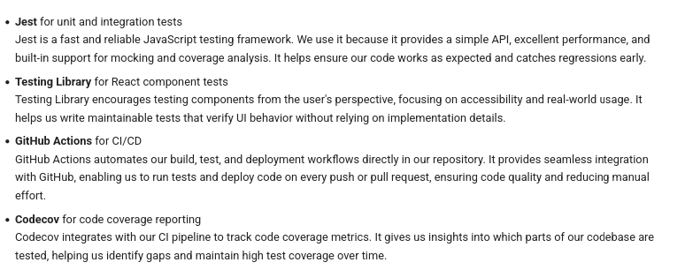
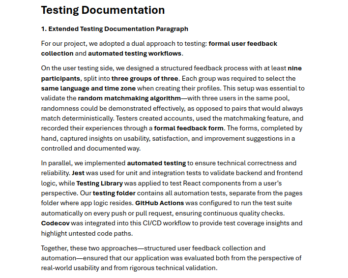
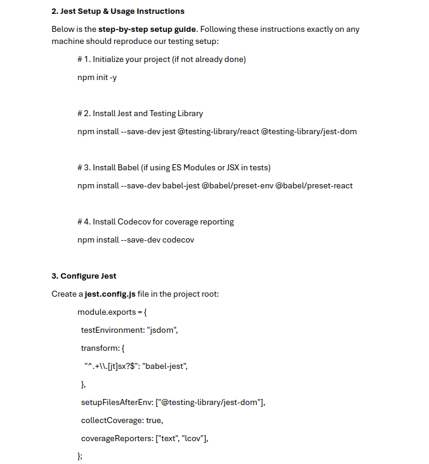
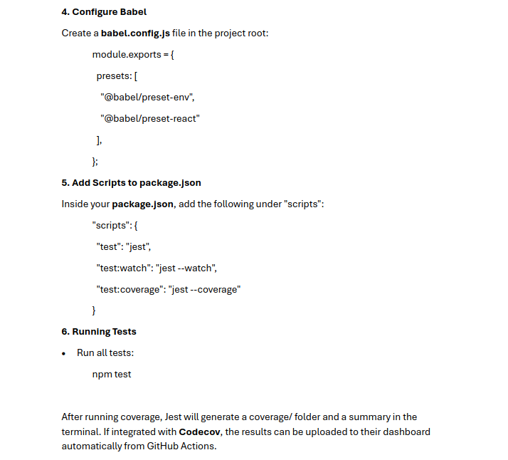

# Testing & CI


  <!-- 

<!-- - **Jest** for unit and integration tests  
    Jest is a fast and reliable JavaScript testing framework. We use it because it provides a simple API, excellent performance, and built-in support for mocking and coverage analysis. It helps ensure our code works as expected and catches regressions early.

- **Testing Library** for React component tests  
    Testing Library encourages testing components from the user's perspective, focusing on accessibility and real-world usage. It helps us write maintainable tests that verify UI behavior without relying on implementation details.

- **GitHub Actions** for CI/CD  
    GitHub Actions automates our build, test, and deployment workflows directly in our repository. It provides seamless integration with GitHub, enabling us to run tests and deploy code on every push or pull request, ensuring code quality and reducing manual effort.

- **Codecov** for code coverage reporting  
    Codecov integrates with our CI pipeline to track code coverage metrics. It gives us insights into which parts of our codebase are tested, helping us identify gaps and maintain high test coverage over time. -->

---


<!-- ## Sprint 2 meeting evidence --> -->
  <!-- 
  
  
 -->


- **Jest** for unit and integration tests  
  Jest is a fast and reliable JavaScript testing framework. We use it because it provides a simple API, excellent performance, and built-in support for mocking and coverage analysis. It helps ensure our code works as expected and catches regressions early.

- **Testing Library** for React component tests  
  Testing Library encourages testing components from the user's perspective, focusing on accessibility and real-world usage. It helps us write maintainable tests that verify UI behavior without relying on implementation details.

- **GitHub Actions** for CI/CD  
  GitHub Actions automates our build, test, and deployment workflows directly in our repository. It provides seamless integration with GitHub, enabling us to run tests and deploy code on every push or pull request, ensuring code quality and reducing manual effort.

- **Codecov** for code coverage reporting  
  Codecov integrates with our CI pipeline to track code coverage metrics. It gives us insights into which parts of our codebase are tested, helping us identify gaps and maintain high test coverage over time.


## Sprint 2 meeting evidence -->

# Testing Documentation

### 1. Extended Testing Documentation Paragraph

For our project, we adopted a dual approach to testing: **formal user feedback collection** and **automated testing workflows**.

On the user testing side, we designed a structured feedback process with at least **nine participants**, split into **three groups of three**. Each group was required to select the **same language and time zone** when creating their profiles. This setup was essential to validate the **random matchmaking algorithm**—with three users in the same pool, randomness could be demonstrated effectively, as opposed to pairs that would always match deterministically. Testers created accounts, used the matchmaking feature, and recorded their experiences through a **formal feedback form**. The forms, completed by hand, captured insights on usability, satisfaction, and improvement suggestions in a controlled and documented way.

In parallel, we implemented **automated testing** to ensure technical correctness and reliability. **Jest** was used for unit and integration tests to validate backend and frontend logic, while **Testing Library** was applied to test React components from a user’s perspective. Our **testing folder** contains all automation tests, separate from the pages folder where app logic resides. **GitHub Actions** was configured to run the test suite automatically on every push or pull request, ensuring continuous quality checks. **Codecov** was integrated into this CI/CD workflow to provide test coverage insights and highlight untested code paths.

Together, these two approaches—structured user feedback collection and automation—ensured that our application was evaluated both from the perspective of real-world usability and from rigorous technical validation.


## 2. Jest Setup & Usage Instructions

Below is the **step-by-step setup guide**. Following these instructions exactly on any machine should reproduce our testing setup:

```bash
# 1. Initialize your project (if not already done)
npm init -y
```

```bash
# 2. Install Jest and Testing Library
npm install --save-dev jest @testing-library/react @testing-library/jest-dom
```

```bash
# 3. Install Babel (if using ES Modules or JSX in tests)
npm install --save-dev babel-jest @babel/preset-env @babel/preset-react
```

```bash
# 4. Install Codecov for coverage reporting
npm install --save-dev codecov
```

## 3.Configure Jest
Create a **jest.config.js** file in the project root:
```bash
module.exports = {
  testEnvironment: "jsdom",
  transform: {
    "^.+\\.[jt]sx?$": "babel-jest",
  },
  setupFilesAfterEnv: ["@testing-library/jest-dom"],
  collectCoverage: true,
  coverageReporters: ["text", "lcov"],
};
```


## 4. Configure Babel

Create a **babel.config.js** file in the project root:

```bash
javascript
module.exports = {
  presets: [
    "@babel/preset-env",
    "@babel/preset-react"
  ],
};
```

## 5. Add Scripts to package.json

Inside your **package.json**, add the following under **"scripts"**:

```bash
json
"scripts": {
  "test": "jest",
  "test:watch": "jest --watch",
  "test:coverage": "jest --coverage"
}
```

## 6. Running Tests

* Run all tests:

```bash
    npm test
```

After running coverage, Jest will generate a \`coverage/\` folder and a summary in the terminal. If integrated with **Codecov**, the results can be uploaded to their dashboard automatically from GitHub Actions.


